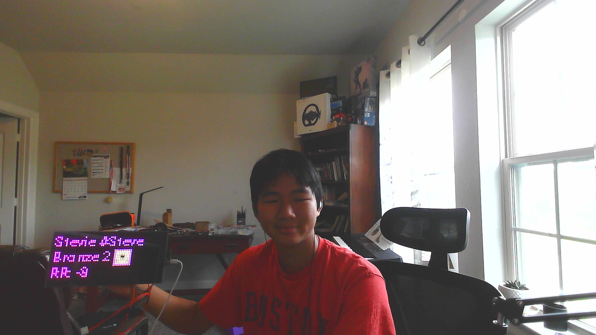

[Home](index.md) | [Code](code.md) 
# Matrix Portal Flow Visualizer
My project, the Matrix Portal Flow Visualizer, was an interesting project that had many ups and downs. Though it's called the Flow Visualizer, the main project isn't the Flow Visualizer due to the code being too glitchy and buggy; I had to pivot to another main project. This led me to the idea of different modes, where in each mode, it runs a different Python file, so it can have different modes. One of the functions of a mode is that it can access a valorant api and display the data on the screen.

| **Engineer** | **School** | **Area of Interest** | **Grade** |
|:--:|:--:|:--:|:--:|
| Steven X | Glenda Dawson High School | Mechanical Engineering | Incoming Junior

  
# Final Milestone

<iframe width="560" height="315" src="https://www.youtube.com/embed/Q3VBB9vsr1M?si=LlsSSnnHHV4FcBnC" title="YouTube video player" frameborder="0" allow="accelerometer; autoplay; clipboard-write; encrypted-media; gyroscope; picture-in-picture; web-share" referrerpolicy="strict-origin-when-cross-origin" allowfullscreen></iframe>

- In this third milestone, I have added a connection between the Matrix Portal M4 and an ESP-32 that was supposed to display data from a sensor to the screen, but due to a broken sensor, I couldn't fully display what the sensor was reading to the screen. 
- Some of the biggest challenges that I have faced are that much of the code took very long to debug, and some of them weren't the code's problem, like my sensor, which was faulty instead.
- I've learned a lot, like how to use an API and how they can integrate into code. I also learned that sometimes when solving problems, you should take it from a different angle, and sometimes you need to switch to another thing before you realize what the problem might be. 
-Something that I hope to learn in the future is the ability to integrate sensors and use the internet to integrate all these functions and be able to make a smart environment, so human tasks could be easier. This would allow people with disabilities to be able to access more functionality in their life. 
# Final Milestone Code
[Code](code.md) 

# Second Milestone

<iframe width="560" height="315" src="https://www.youtube.com/embed/QSbWj-pGbiI?si=XmT6LRNO0g3uPgXG" title="YouTube video player" frameborder="0" allow="accelerometer; autoplay; clipboard-write; encrypted-media; gyroscope; picture-in-picture; web-share" referrerpolicy="strict-origin-when-cross-origin" allowfullscreen></iframe>

- For the second milestone, I have added the ability to have the screen flip through different animations like a clock, a flow simulation, and finally a screen that shows my rank and how much RR I lost. This is done by fetching data from an API that works with Valorant to check my account data.
- Something that has been very surprising in my journey to make this code work was how many things that seem simple from the outside, like my Valorant API, take a long time to get working. Some of the other issues that seem surprising to me were how many difficult challenges I tried to overcome that required only 1 or 2 steps to fully fix.
- A challenge that I couldn't figure out was the ability to fetch data through an API, because CircuitPython uses a different fetch system than what normal Python works with. Though that wasn't the problem, and it was a simple, few-step fix that took me a few minutes. The problem wasn't with my code but with an outdated software that took a few clicks to fix. This has allowed to me to realize I need to think about the bigger picture on my problems, as the problem could be something that may be different then just my code.
- I need to make a network that would allow me to communicate between the screen and other devices, so I can get readings from another microcontroller and be able to display them on my screen.
  
# Second Milestone Code
[Code](code.md) 

# First Milestone

<iframe width="560" height="315" src="https://www.youtube.com/embed/6Rt9wJ12GzU?si=XAUVdCQhY9lnhJn5&amp;start=1" title="YouTube video player" frameborder="0" allow="accelerometer; autoplay; clipboard-write; encrypted-media; gyroscope; picture-in-picture; web-share" referrerpolicy="strict-origin-when-cross-origin" allowfullscreen></iframe>

- There are 2 important components in my build: the Matrix Portal M4 microcontroller and the 64x32 LED board. With these components, I will  use the microcontroller to connect to the internet and check the time and time zone of where the board is, and display it on the 64x32 LED board. 
- I've learned how to use and manipulate the software of the Matrix Portal M4 microcontroller and how to connect the board to the internet. Through my problems, I have learned how to debug the microcontroller using the serial output and other similar ways to debug the microcontroller.
- I've faced many challenges because this wasn't my original plan with the Matrix Portal M4; the original plan was to make a flow visualizer, but due to nasty code that crashed the microcontroller, I had to change the project. Even after 6 hours of trying to debugging, the instructors and I could't figure out the problem to the issue. This led me to do the Time clock.
- I could add Animations to the screen that would make the screen smoother and allow it to transition between screens. I also want to add more information from the internet to the screen, like the weather or the stock market. If I still have time, I would also like to add the score of my games on the screen.

# First Milestone Code
[Code](code.md)

# Bill of Materials

| **Part** | **Note** | **Price** | **Link** |
|:--:|:--:|:--:|:--:|
| Matrix Portal Flow Visualizer | The screen that shows LED Flow | $69.95 | <a href="https://www.adafruit.com/product/4812"> Link </a> |
| USB type A to type C cable | Connecting the Matrix Portal M4 to your computer | $3.95 | <a href="https://www.adafruit.com/product/4473"> Link </a> |
| Wire Stand | Use the stand to hold the screen in place | $4.95 | <a href="https://www.adafruit.com/product/1679"> Link </a> |
| Screwdriver | Used to put the screws into the M4 chip | $1.50 | <a href="https://www.adafruit.com/product/3284"> Link </a> |
| Mini Speaker | Used to add sound to the screen (I have the wrong wire right now) | $1.95 | <a href="https://www.adafruit.com/product/3923"> Link </a> |
| Precision Temp & Humidity Sensor | Used to send information to the esp32(I think it's bricked) | $58.95 | <a href="https://www.adafruit.com/product/4867"> Link </a> |
| ESP32 board with STEMMA QT / Qwiic connector | Used to send data to the MatrixPortal using the internet| $1.50 | <a href="https://www.adafruit.com/product/5405"> Link </a> |
| Matrix portal S3 | Used replace the M4 chip to a stronger processor and more ram and data | $19.95 | <a href="https://www.adafruit.com/product/5778"> Link </a> |
| MAX98357 I2S Class-D Mono Amp | used as a driver for the speaker(wrong wire right now)  | $4.50 | <a href="[https://www.adafruit.com/product/3284](https://www.digikey.com/en/products/detail/adafruit-industries-llc/5647/21283812?gad_source=1&gad_campaignid=20243136172&gbraid=0AAAAADrbLlh-6T16Vrium77g_FMBakpQ4&gclid=Cj0KCQjwhO3DBhDkARIsANxrhTorzYELKxenF74fJfHs2Vwa49Nm6J4P5HvHJOYHqi74qSeeiFK8sD4aAuftEALw_wcB&gclsrc=aw.ds)"> Link </a> |
| Qwiic to Qwiic Cables  | Used to connect the sensor to esp32(sensor is not working)| $1.50 | <a href="[https://www.adafruit.com/product/3284](https://a.co/d/j1Xf3cD)"> Link </a> |

